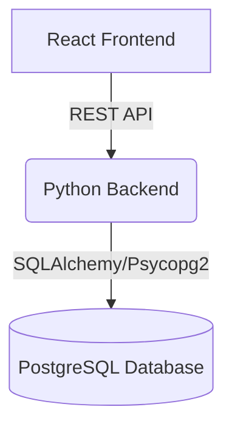

# System Architecture: Trade Aggregator

## 1. High-Level Overview

The Trade Aggregator is a modern, decoupled web application composed of a React-based single-page application (SPA) frontend, a Python (FastAPI/Flask) backend, and a PostgreSQL database.

This architecture ensures scalability, maintainability, and clean separation of concerns.

## 2. Frontend Architecture (React)

The frontend is responsible for the user interface, file uploading, and rendering the final aggregated dashboard.

**Key Technologies:**
- **React.js**: For building interactive UI components.
- **Vite**: Fast build tool and dev server.
- **Tailwind CSS**: For clean, fresh, and modern aesthetic styling.
- **Axios / Fetch**: For communicating with the Python backend API.
- **React-Dropzone**: For an intuitive drag-and-drop file upload experience.
- **React-Table / AG Grid**: For rendering complex data grids, supporting sorting, and filtering the consolidated transaction view.

**Core Components:**
- `UploadView`: Handles file selection (Excel/CSV), provides upload progress feedback, and displays validation errors.
- `DashboardView`: The central reporting interface showing the normalized grid of transactions. Includes overall metrics (e.g., total PnL).

## 3. Backend Architecture (Python)

The backend handles the core business logic, file parsing, data normalization, and database interactions.

**Key Technologies:**
- **FastAPI** (preferred over Flask for robust data validation and async IO) or **Flask** (for simplicity).
- **Pandas**: The backbone for data manipulation. Used to ingest varied Excel/CSV schemas and normalize them into generic dataframes.
- **SQLAlchemy (ORM)**: For database interaction and managing the schema migrations.
- **Pydantic** (if using FastAPI): For rigorous validation of incoming data payloads and structuring the API responses.

**Core Modules:**
- `api/routes.py`: Defines RESTful endpoints (`POST /upload`, `GET /transactions`).
- `services/parser.py`: Contains the logic to inspect uploaded files, detect the brokerage format based on headers/structure, and extract standard fields.
- `services/normalizer.py`: Standardizes data ranges, ticker symbols, and performs deduplication based on `Transaction ID` and `transaction date`.
- `db/models.py`: Defines the SQLAlchemy models for the `Transaction` entity.

## 4. Database Schema (PostgreSQL)

PostgreSQL is a robust relational database suited for structured transactional data.

### Table: `transactions`

| Column Name | Data Type | Constraints | Description |
| :--- | :--- | :--- | :--- |
| `id` | UUID/Serial | Primary Key | internal identifier |
| `broker_tx_id` | String | Unique* | The transaction ID provided by the brokerage. |
| `transaction_date` | Date/Timestamp | Not Null | Date of transaction execution. |
| `account_name` | String | Not Null | Brokerage account identifier. |
| `broker_name` | String | | Identified source (e.g., "Fidelity", "Interactive Brokers"). |
| `commodity_ticker` | String | Not Null | Asset symbol. |
| `quantity` | Decimal | Not Null | Quantity traded. |
| `position_details` | String | | e.g. "Long", "Short", "Options Strike".|
| `expiry_date` | Date | | Applicable for derivatives/options. |
| `purchase_price` | Decimal | | Entry price per unit. |
| `sold_price` | Decimal | | Exit price per unit. |
| `total_pnl` | Decimal | | Calculated (Sold - Purchase) * Quantity. |
| `status` | String | | e.g., "Open", "Closed", "Pending". |

*\* Note: The combination of `broker_tx_id` and `transaction_date` (and possibly `broker_name`) will act as a composite unique constraint to enforce the strict zero-deduplication requirement during uploads.*

## 5. Data Flow: The Upload & Normalization Pipeline

1. **User Action**: The user drags and drops multiple CSV/Excel files into the React UI.
2. **API Request**: The frontend sends a `multipart/form-data` request to the backend `POST /upload` endpoint.
3. **Ingestion & Parsing**: The backend reads the files directly into memory (or temp files) using Pandas.
4. **Format Detection**: The parser module inspects the columns to identify the source broker format.
5. **Normalization**: Data is mapped to standard column names and generic types.
6. **Deduplication Check**: The backend queries the PostgreSQL DB to check for existing `broker_tx_id` + `transaction_date` pairs. Any intersecting rows in the incoming dataset are dropped.
7. **Storage**: The remaining distinct records are bulk inserted into PostgreSQL.
8. **Response**: The backend responds with success/failure statistics (e.g., "50 inserted, 12 duplicates ignored").
9. **Dashboard Refresh**: The React frontend re-fetches the latest state from `GET /transactions` and updates the DashboardView.
